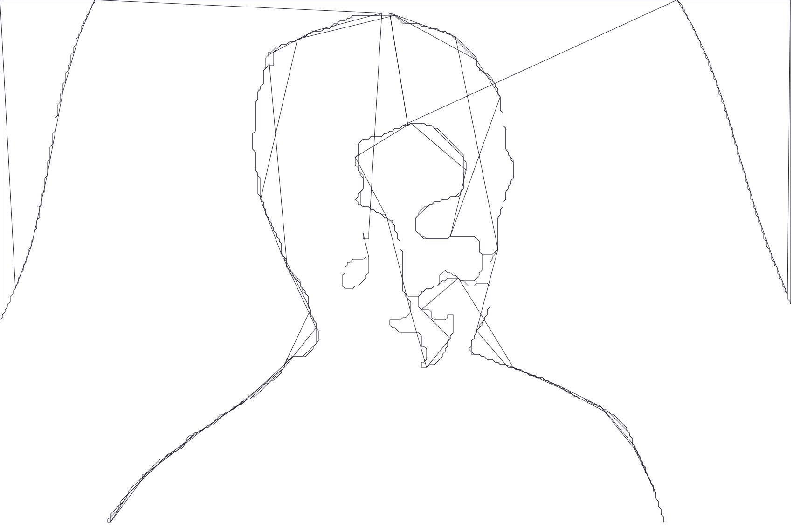
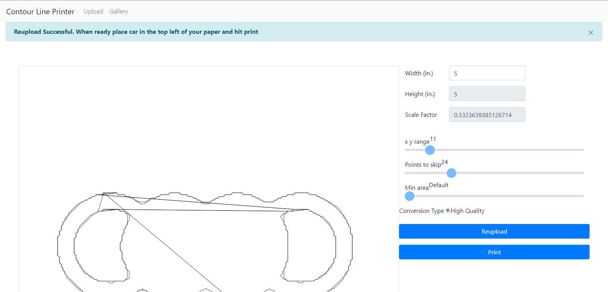
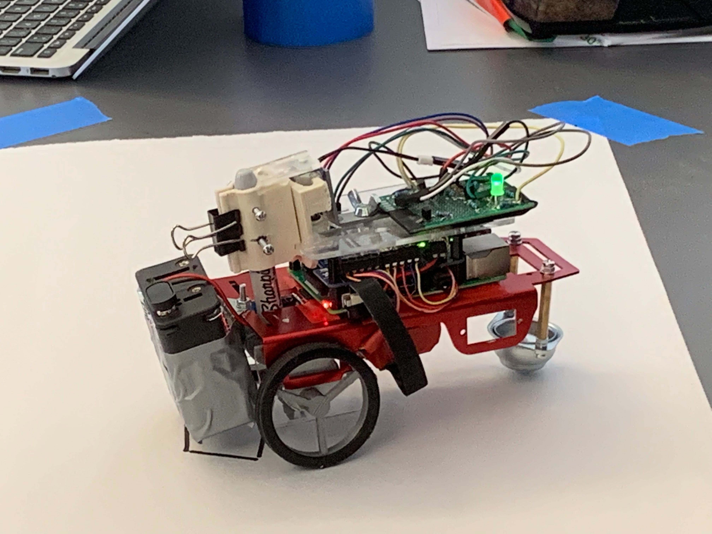

# Contour Line Printer

Table of Contents
1. [Introduction](#introduction)
2. [Conversion](#conversion)
3. [Printer](#printer)

## Introduction <a name="introduction"></a>

### Contour Line Printer is a Temple University Capstone project completed in Spring 2019.  The goal of the project is to create a printer that can output your photos at any size.


</br>

## Conversion <a name="conversion"></a>


##### Original Image

</br>


##### Converted to a contour line drawling

</br>
</br>

```
By converting pixel based images into vectors, 
Users are able to scale their image to the size they wish to print.
```

</br>
</br>



</br>
</br>

## Printer <a name="printer"></a>



##### A Raspberry Pi recieves driving insturctions from the server

</br>

Car Features:
- **Led Status Light** - Shows that the car is connected to the server, or currently printing
- **Marker Lifting Mecanism** - Lifts the marker so the first line is not printed 
- **Two stepper motors** - Drives the car
- **Raspberry Pi** - steers the car
- **Marker** - Draws your photo
- **Battery Packs** - Powers for the Pi and wheels

