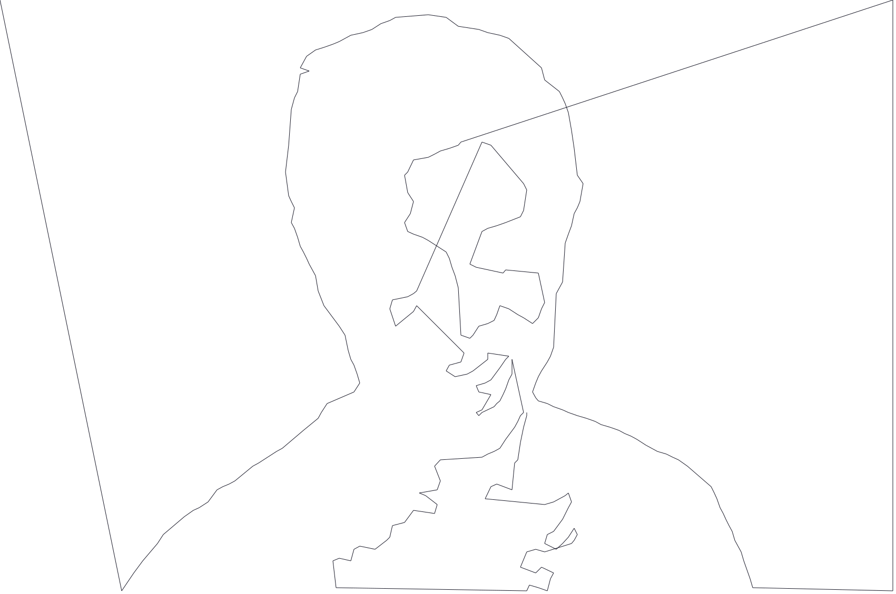

# Contour Line Printer


### Contour Line Printer is a Temple University Capstone project completed in Spring 2019.  The goal of the project is to create a printer that can output your photos at any size.

Table of Contents

</br>

## Conversion <a name="introduction"></a>
1. [Introduction](#introduction)
2. [Some paragraph](#paragraph1)
3. [Another paragraph](#paragraph2)


##### Original Image

</br>


##### Converted to a contour line drawling

</br>
</br>

```
By converting pixel based images into vectors, the user is able to scale their image to match the size they wish to print.
```

</br>
</br>


</br>
</br>
___

### Car


